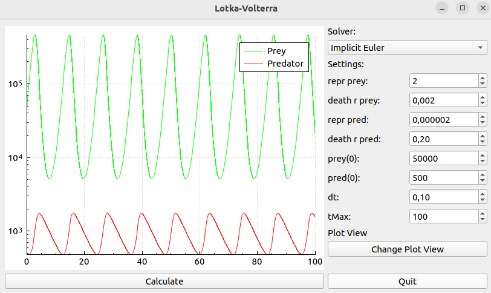

# LotkaVolterra

This gui application is a numerical solver for the famous Lotka-Volterra equations.
The user can choose between the explicit or implicit euler solver, set the initial condition as well as parametrize the model. Subsequently, the result can be plotted in time domain. The user can also switch between time series data and the corresponding phase plot.

## Getting Started

To install and run this application, follow these steps:

1. Clone the repository: `git clone https://git@github.com:SzVarga/LotkaVolterra.git`
2. Navigate to the project directory: `cd LotkaVolterra`
3. Make sure to install the dependencies on your system:
- `qtbase5-dev`
- `qtbase5-dev-tools`
- `qt5-qmake`
4. Compile project from source:
```bash
qmake
make
```
5. Run the application:
```bash
./LotkaVolterra
```

## Usage

Once the application is running, you can perform the following actions:

- Select the solver type (explicit or implicit euler)
- Set the initial conditions and model parameters
- Plot the results in the time domain
- Switch between time series data and phase plot

<table>
  <tr>
    <td align="center"></td>
    <td align="center"></td>
  </tr>
  <tr>
    <td align="center"></td>
    <td align="center"></td>
  </tr>
</table>

## License

This project is licensed under the [MIT License](LICENSE).
